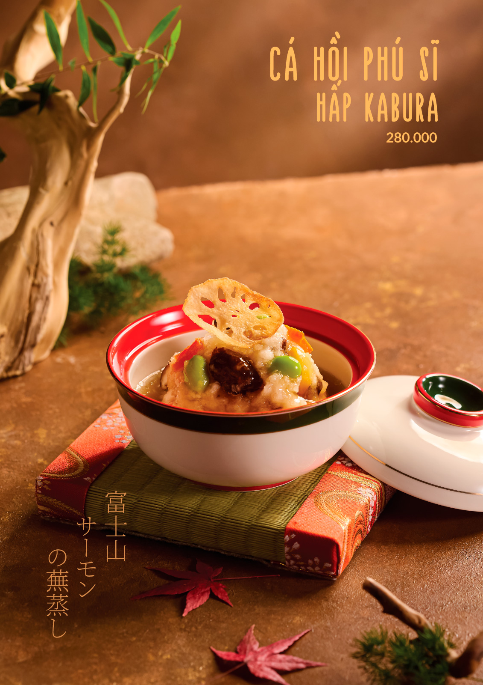

# WA JAPANESE CUISINE - HỆ THỐNG QUẢN LÝ NHÀ HÀNG

## 🍱 Tổng quan dự án

**Wa Japanese Cuisine** là hệ thống website quản lý nhà hàng Nhật Bản hoàn chỉnh, bao gồm cả phần khách hàng và phần quản trị viên. Dự án được xây dựng với HTML, CSS, JavaScript và PHP, tích hợp MySQL để quản lý dữ liệu.

### ✨ Tính năng chính

#### 🎯 Dành cho Khách hàng:
- **Trang chủ**: Giới thiệu nhà hàng, hiển thị món ăn nổi bật
- **Thực đơn**: Xem danh sách món ăn đầy đủ với hình ảnh, giá cả, mô tả chi tiết
- **Giỏ hàng**: Thêm món vào giỏ, điều chỉnh số lượng, tính tổng tiền tự động
- **Đặt bàn**: Tìm kiếm và đặt bàn tại các chi nhánh nhà hàng
- **Thanh toán**: Quy trình thanh toán 4 bước (Giỏ hàng → Địa chỉ → Thanh toán → Xác nhận)
- **Tài khoản**: Đăng ký, đăng nhập, quản lý thông tin cá nhân
- **Lịch sử**: Xem lịch sử đặt món và đặt bàn

#### 👨‍💼 Dành cho Quản trị viên:
- **Đăng nhập Admin**: Bảo mật với mật khẩu (mặc định: 1111)
- **Quản lý đặt bàn**: Xem, chỉnh sửa, chấp nhận/từ chối đơn đặt bàn
- **Quản lý đơn hàng**: Xem chi tiết đơn hàng, chỉnh sửa thông tin khách hàng
- **Quản lý ưu đãi**: Tạo và gửi ưu đãi cho khách hàng đã sử dụng dịch vụ
- **Lọc theo ngày**: Xem đơn hàng/đặt bàn theo từng ngày cụ thể

---

## 📋 YÊU CẦU HỆ THỐNG

- **Web Server**: Apache (XAMPP) hoặc Nginx
- **PHP**: Version 7.4 trở lên
- **MySQL**: Version 5.7 trở lên hoặc MariaDB 10.3+
- **Browser**: Chrome, Firefox, Safari, Edge (phiên bản mới nhất)

---

## 🚀 HƯỚNG DẪN CÀI ĐẶT

### Bước 1: Cài đặt Database

1. Mở **phpMyAdmin** hoặc MySQL command line
2. Tạo database mới:
   ```sql
   CREATE DATABASE wa_japanese_cuisine CHARACTER SET utf8mb4 COLLATE utf8mb4_unicode_ci;
   ```

3. Import file schema:
   - Mở file `database/schema.sql`
   - Copy toàn bộ nội dung
   - Paste vào phpMyAdmin SQL tab và Execute
   - Hoặc dùng command line:
   ```bash
   mysql -u root -p wa_japanese_cuisine < database/schema.sql
   ```

### Bước 2: Cấu hình Database Connection

1. Mở file `php/config.php`
2. Cập nhật thông tin kết nối database:
   ```php
   define('DB_HOST', 'localhost');      // Host của database
   define('DB_USER', 'root');           // Username MySQL
   define('DB_PASS', '');               // Password MySQL
   define('DB_NAME', 'wa_japanese_cuisine');  // Tên database
   ```

3. Cập nhật SITE_URL nếu cần:
   ```php
   define('SITE_URL', 'http://localhost/Restaurant%20reservation');
   ```

### Bước 3: Cập nhật Menu Items với Item IDs

Mở file `menu.html` và thêm `data-item-id` cho mỗi menu card:

```html
<article class="menu-card" data-category="appetizer" data-item-id="1">
  
  <div class="card-body">
    <div class="price">295.000 đ</div>
    <h3 class="title">Súp cá Hamo và nấm tuyết tùng</h3>
    <hr class="card-line">
  </div>
</article>
```

**Danh sách Item IDs trong database:**
- ID 1: Salmon Sushi - 120,000đ
- ID 2: Tuna Sushi - 150,000đ
- ID 3: Ebi Sushi - 100,000đ
- ID 4: Salmon Sashimi - 180,000đ
- ID 5: Mixed Sashimi - 250,000đ
- ID 6: Tonkotsu Ramen - 85,000đ
- ID 7: Miso Ramen - 80,000đ
- ID 8: Shoyu Ramen - 75,000đ
- ID 9: Ebi Tempura - 95,000đ
- ID 10: Vegetable Tempura - 65,000đ
- ID 11: Green Tea - 30,000đ
- ID 12: Sake - 120,000đ

### Bước 4: Thêm Cart Badge vào Header

Cập nhật tất cả các file HTML (home.html, menu.html, about.html, etc.) với cart badge:

```html
<div class="nav-right" aria-label="Liên kết biểu tượng">
  <svg>...</svg> <!-- Search icon -->
  
  <!-- Cart icon with badge -->
  <a href="cart.html" style="position: relative; display: inline-block;">
    <svg fill="none" stroke="currentColor" stroke-width="2" stroke-linecap="round" stroke-linejoin="round" viewBox="0 0 24 24" height="24" width="24">
      <circle cx="9" cy="21" r="1"></circle>
      <circle cx="20" cy="21" r="1"></circle>
      <path d="M1 1h4l2.68 13.39a1 1 0 0 0 .99.61h12.72a1 1 0 0 0 .96-.73l3.38-12.07H6"></path>
    </svg>
    <span id="cartBadge" class="cart-badge">0</span>
  </a>
  
  <a href="login.html">
    <svg>...</svg> <!-- User icon -->
  </a>
</div>
```

### Bước 5: Load JavaScript Files

Thêm cart.js vào menu.html và cart.html:

```html
<script src="js/scripts.js"></script>
<script src="js/cart.js"></script>
</body>
</html>
```

---

## 📚 CẤU TRÚC DATABASE

### Tables

1. **users** - Quản lý người dùng
   - user_id, full_name, email, password_hash, phone, address

2. **categories** - Danh mục món ăn
   - category_id, category_name, category_slug

3. **menu_items** - Món ăn
   - item_id, category_id, item_name, description, price, image_url

4. **cart_items** - Giỏ hàng
   - cart_id, user_id/session_id, item_id, quantity, special_instructions

5. **orders** - Đơn hàng
   - order_id, order_number, customer info, totals, status

6. **order_items** - Chi tiết đơn hàng
   - order_item_id, order_id, item_id, quantity, unit_price

7. **reservations** - Đặt bàn
   - reservation_id, customer info, date, time, party_size, status

---

## 🛠️ API ENDPOINTS

### Cart API (`api/cart.php`)

**Get Cart Items**
```
GET /api/cart.php?action=get
Response: {success, items[], count, subtotal, totals{}}
```

**Add to Cart**
```
POST /api/cart.php?action=add
Body: {item_id, quantity, special_instructions}
Response: {success, message, action}
```

**Update Quantity**
```
POST /api/cart.php?action=update
Body: {cart_id, quantity}
Response: {success, message}
```

**Remove Item**
```
POST /api/cart.php?action=remove
Body: {cart_id}
Response: {success, message}
```

**Clear Cart**
```
POST /api/cart.php?action=clear
Response: {success, message}
```

**Get Cart Count**
```
GET /api/cart.php?action=count
Response: {success, count}
```

---

## 💻 JAVASCRIPT FUNCTIONS

### cart.js Functions

```javascript
// Thêm món vào giỏ hàng
addToCart(itemId, quantity, specialInstructions)

// Cập nhật số lượng
updateQuantity(cartId, newQuantity)

// Xóa món khỏi giỏ
removeFromCart(cartId)

// Cập nhật badge số lượng giỏ hàng
updateCartBadge()

// Hiển thị thông báo
showNotification(message, type)

// Format giá tiền
formatPrice(price)
```

---

## 🎨 CSS CLASSES

### Cart Page Classes

- `.cart-page` - Container trang giỏ hàng
- `.cart-header` - Header với title và nút
- `.cart-items-list` - Danh sách món
- `.cart-item` - Mỗi món trong giỏ
- `.cart-summary` - Tổng kết đơn hàng
- `.cart-badge` - Badge số lượng trên icon giỏ hàng
- `.empty-cart` - Trạng thái giỏ hàng trống
- `.notification` - Thông báo popup

---

---

## 📂 CẤU TRÚC DỰ ÁN

```
Restaurant reservation/
├── home.html              # Trang chủ
├── menu.html              # Thực đơn
├── cart.html              # Giỏ hàng
├── checkout.html          # Trang checkout
├── payment.html           # Thanh toán
├── confirmation.html      # Xác nhận đơn hàng
├── reserve.html           # Tìm kiếm nhà hàng
├── booking-form.html      # Form đặt bàn
├── booking-success.html   # Đặt bàn thành công
├── login.html             # Đăng nhập khách hàng
├── signup.html            # Đăng ký tài khoản
├── profile.html           # Trang cá nhân
├── admin-login.html       # Đăng nhập admin
├── admin-bookings.html    # Quản lý đặt bàn
├── admin-orders.html      # Quản lý đơn hàng
├── admin-promotions.html  # Quản lý ưu đãi
├── about.html             # Về chúng tôi
├── story.html             # Câu chuyện
├── locations.html         # Các chi nhánh
│
├── css/
│   └── styles.css         # CSS chính (5700+ dòng)
│
├── js/
│   ├── scripts.js         # JavaScript chung
│   ├── cart.js            # Logic giỏ hàng
│   ├── checkout.js        # Logic checkout
│   ├── payment.js         # Logic thanh toán
│   ├── confirmation.js    # Xác nhận đơn hàng
│   ├── auth.js            # Xác thực người dùng
│   ├── profile.js         # Trang cá nhân
│   ├── reserve.js         # Đặt bàn
│   ├── admin-auth.js      # Xác thực admin
│   ├── admin.js           # Quản lý bookings
│   ├── admin-orders.js    # Quản lý orders
│   └── admin-promotions.js # Quản lý ưu đãi
│
├── php/
│   └── config.php         # Cấu hình database
│
├── api/
│   ├── cart.php           # API giỏ hàng
│   ├── login.php          # API đăng nhập
│   ├── register.php       # API đăng ký
│   ├── get-profile.php    # API lấy thông tin
│   └── update-profile.php # API cập nhật profile
│
├── database/
│   └── schema.sql         # Database schema
│
└── assets/               # Hình ảnh, tài nguyên
    ├── menu/             # Hình món ăn
    ├── locations/        # Bản đồ chi nhánh
    ├── login/            # Background login
    └── ...
```

---

## 🔑 THÔNG TIN ĐĂNG NHẬP

### Admin
- **URL**: `admin-login.html`
- **Mật khẩu**: `1111`

### Khách hàng
- Đăng ký tài khoản mới tại `signup.html`
- Hoặc đăng nhập tại `login.html`

---

## 💾 LƯU TRỮ DỮ LIỆU

Hiện tại dự án sử dụng **localStorage** để lưu trữ:
- `cart`: Giỏ hàng
- `user`: Thông tin người dùng đăng nhập
- `orderHistory`: Lịch sử đặt món
- `bookingHistory`: Lịch sử đặt bàn
- `promotionHistory`: Lịch sử ưu đãi

**sessionStorage**:
- `adminLoggedIn`: Trạng thái đăng nhập admin
- `orderData`: Dữ liệu đơn hàng tạm
- `pendingBooking`: Đặt bàn đang xử lý

> **Lưu ý**: Để tích hợp database đầy đủ, cần triển khai các API endpoints trong thư mục `api/`

---

## ✅ TESTING

### Test Cart Functionality

1. **Thêm món vào giỏ:**
   - Vào trang menu.html
   - Click vào món ăn bất kỳ
   - Chọn số lượng và click "THÊM VÀO GIỎ"
   - Kiểm tra badge số lượng tăng lên

2. **Xem giỏ hàng:**
   - Click vào icon giỏ hàng
   - Kiểm tra món đã thêm hiển thị đúng
   - Kiểm tra tính toán giá đúng

3. **Checkout Flow:**
   - Hoàn thành form địa chỉ
   - Chọn phương thức thanh toán
   - Xác nhận đơn hàng

4. **Test Admin:**
   - Đăng nhập với mật khẩu 1111
   - Kiểm tra quản lý đặt bàn
   - Kiểm tra quản lý đơn hàng
   - Tạo ưu đãi cho khách hàng

---

## 🔐 SECURITY FEATURES

- ✅ Prepared statements (PDO) - Chống SQL Injection
- ✅ Input sanitization - Làm sạch dữ liệu input
- ✅ Session management - Quản lý session an toàn
- ✅ Password validation - Xác thực mật khẩu admin
- ✅ XSS protection với htmlspecialchars

---

## 📱 RESPONSIVE DESIGN

Website được thiết kế responsive cho:
- 🖥️ Desktop (> 968px)
- 📱 Tablet (640px - 968px)  
- 📱 Mobile (< 640px)

---

## 🎨 CÔNG NGHỆ SỬ DỤNG

- **Frontend**: HTML5, CSS3, JavaScript ES6+
- **Backend**: PHP 7.4+
- **Database**: MySQL 5.7+ / MariaDB
- **Font**: Google Fonts - Lora (serif)
- **Icons**: SVG inline
- **Maps**: Google Maps Embed API

---

## 📞 HỖ TRỢ

Nếu gặp vấn đề khi cài đặt hoặc sử dụng, vui lòng kiểm tra:
- XAMPP đã khởi động Apache và MySQL chưa
- Database đã import schema.sql chưa
- File config.php đã cấu hình đúng chưa
- Đường dẫn file đúng với cấu trúc thư mục

---

## 📄 LICENSE

© 2024 Wa Japanese Cuisine. All rights reserved.
4. **User Dashboard**: Trang quản lý tài khoản
5. **Admin Panel**: Quản lý đơn hàng, menu
6. **Email Notifications**: Gửi email xác nhận
7. **Promo Codes**: Hệ thống mã giảm giá

---

## 📞 SUPPORT

Nếu gặp vấn đề:
1. Kiểm tra console browser (F12)
2. Kiểm tra PHP error log
3. Kiểm tra MySQL connection
4. Đảm bảo đúng file permissions

---

## 📄 LICENSE

© 2024 Wa Japanese Cuisine - All Rights Reserved
